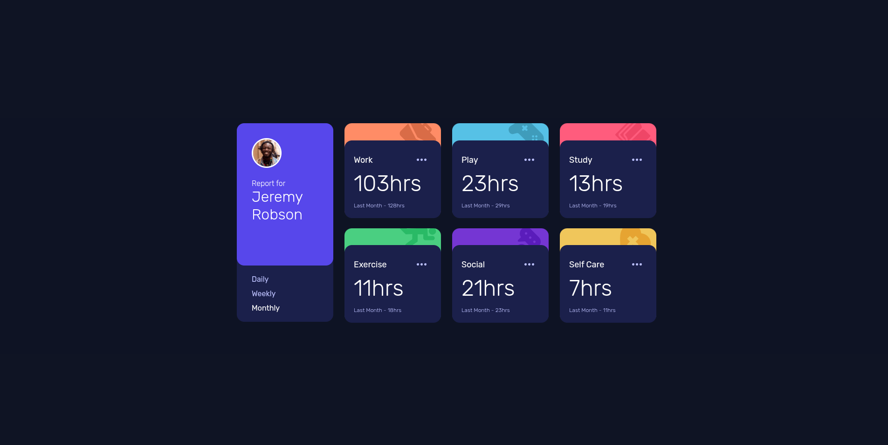

# Frontend Mentor - Time tracking dashboard solution

This is a solution to the [Time tracking dashboard challenge on Frontend Mentor](https://www.frontendmentor.io/challenges/time-tracking-dashboard-UIQ7167Jw). Frontend Mentor challenges help you improve your coding skills by building realistic projects.

## Overview

### The challenge

Users should be able to:

- View the optimal layout for the site depending on their device's screen size
- See hover states for all interactive elements on the page
- Switch between viewing Daily, Weekly, and Monthly stats

### Screenshot



### Links

- Solution URL: [https://github.com/yourusername/time-tracking-dashboard](https://github.com/async-kita/time-tracking-dashboard)
- Live Site URL: [https://yourusername.github.io/time-tracking-dashboard/](https://async-kita.github.io/time-tracking-dashboard/)

## My process

### Built with

- Semantic HTML5 markup
- CSS custom properties (variables)
- Flexbox & CSS Grid
- Mobile-first workflow
- Vanilla JavaScript (ES6)
- Fetch API for local data loading
- BEM-like class naming

### What I learned

While building this dashboard, I reinforced my understanding of:

- **CSS Grid**: creating a responsive layout that switches from 1 column on mobile to 4 columns on desktop, with the profile card spanning two rows.
- **Dynamic rendering**: fetching `data.json` and injecting cards with JavaScript, updating content when the user switches time periods.
- **State management**: keeping track of the active view (`daily`/`weekly`/`monthly`) and updating both data and UI (active tab class, ARIA attributes).
- **ARIA accessibility**: using `role="tablist"`, `role="tab"`, `aria-selected` to make the period switcher accessible to screen readers.
- **CSS hover transitions**: smooth color changes on interactive elements.

One code snippet I'm proud of:

```js
updateInfo() {
  this.itemElement = this.rootElement.querySelectorAll(this.selectors.item);
  this.itemElement.forEach(item => item.remove());
  this.render(this.state.data);
}
```

This method efficiently clears only the dashboard items before re‑rendering, keeping the profile card intact.

### Continued development

- In future projects, I want to:
- Add a loading state (skeleton or spinner) while fetching data.
- Implement client-side storage (e.g., localStorage) to remember the user’s last selected period.
- Improve error handling for network failures or malformed JSON.
- Add subtle animations when switching between periods (e.g., a fade or slide transition).

### Useful resources

- [Example resource 1](https://www.example.com) - This helped me for XYZ reason. I really liked this pattern and will use it going forward.
- [Example resource 2](https://www.example.com) - This is an amazing article which helped me finally understand XYZ. I'd recommend it to anyone still learning this concept.

### AI Collaboration

Describe how you used AI tools (if any) during this project. This helps demonstrate your ability to work effectively with AI assistants.

- What tools did you use (e.g., ChatGPT, Claude, GitHub Copilot)?
- How did you use them (e.g., debugging, generating boilerplate, brainstorming solutions)?
- What worked well? What didn't?

## Author

- Frontend Mentor - [@async-kita](https://www.frontendmentor.io/profile/async-kita)

## Acknowledgments

This is where you can give a hat tip to anyone who helped you out on this project. Perhaps you worked in a team or got some inspiration from someone else's solution. This is the perfect place to give them some credit.
